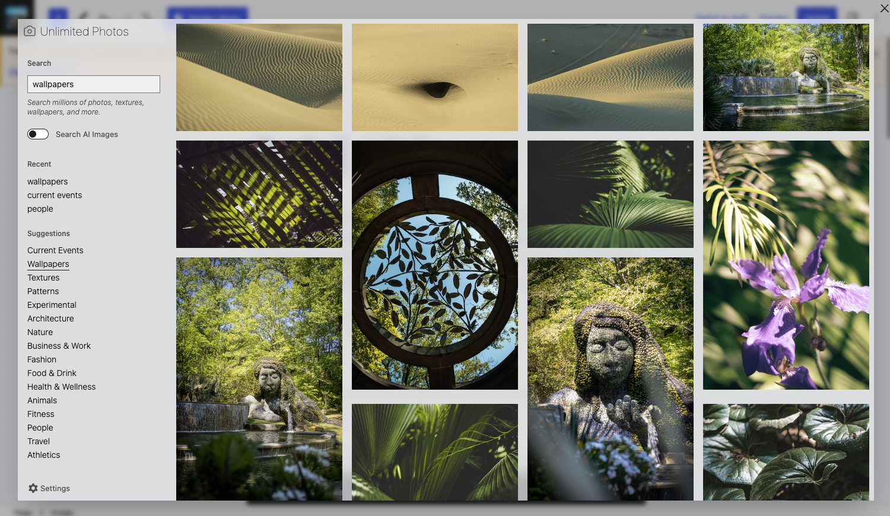
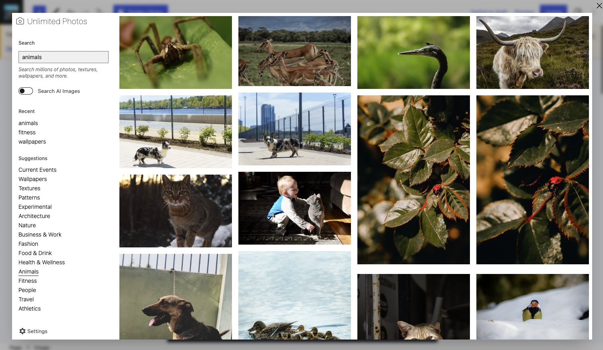

A Gutenberg block that interfaces with the Unsplash API and imports images directly into the Gutenberg core image block.

View this block plugin [on WordPress.org](https://wordpress.org/plugins/unlimited0photos)

## Features
- Search over 3 million photos, textures, wallpapers, and more.
- Import photos right into the core image block (and the media library too)
- Search anything, or select from a predefined list
- No lock in, delete at any time and nothing changes

## Example Screenshots

